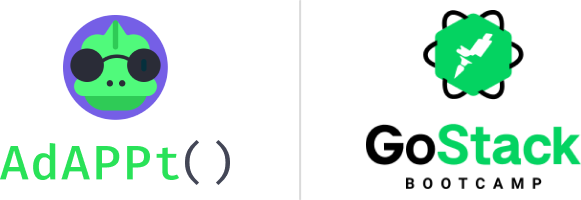
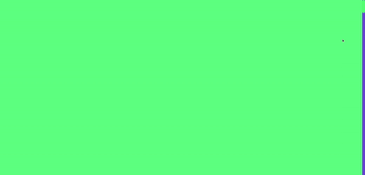

<h1 align="center">
  
</h1>

<h3 align="center">Desafio Expansion Week GoStack 14</h3>

Landing page **AdAPPt()** criada para o desafio da **Expansion Week** do GoStack 14. Apesar de ser uma landing page simples, tentei incorporar um pouquinho (_bem_ pouquinho) de interatividade para aproveitar o React. A estilização da página foi feita com **styled-components**.

## 🖼️ Gif

_Primeiras seções da página_

## 🛠️ Dependências

- TypeScript
- styled-components
- react-awesome-reveal
- react-countup

---

⚠️ **Como o tempo era curto, não deu tempo de deixar responsive!** 😭😭😭
