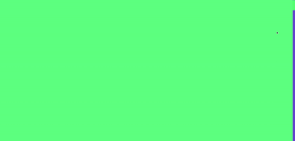
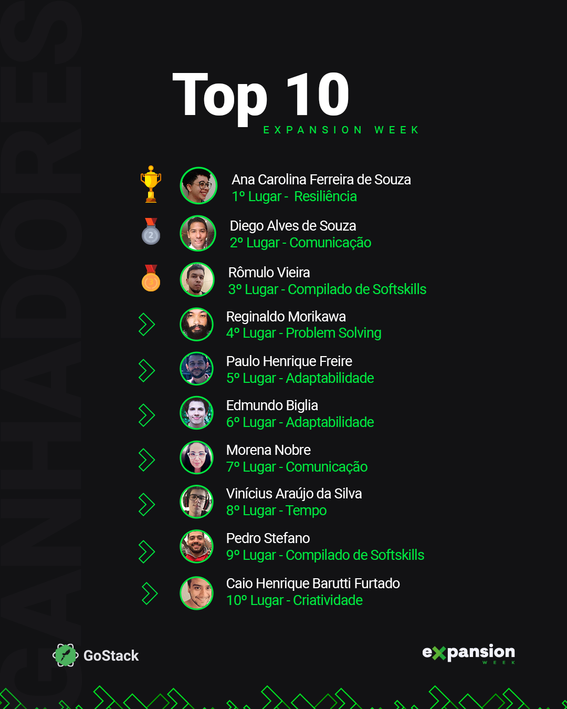

<h1 align="center">
  
</h1>

<h3 align="center">Desafio Expansion Week GoStack 14</h3>

Landing page criada para o desafio da **Expansion Week** do bootcamp GoStack 14. Demo <a href="https://edmundobiglia.github.io/gostack14-expansion-week-challenge">aqui</a>.

A página ficou em **6º lugar no ranking das 10 melhores** entregas do desafio escolhidas pela Rocketseat.

  

## 🛠️ Dependências

- React.js
- TypeScript
- styled-components
- react-awesome-reveal
- react-countup
